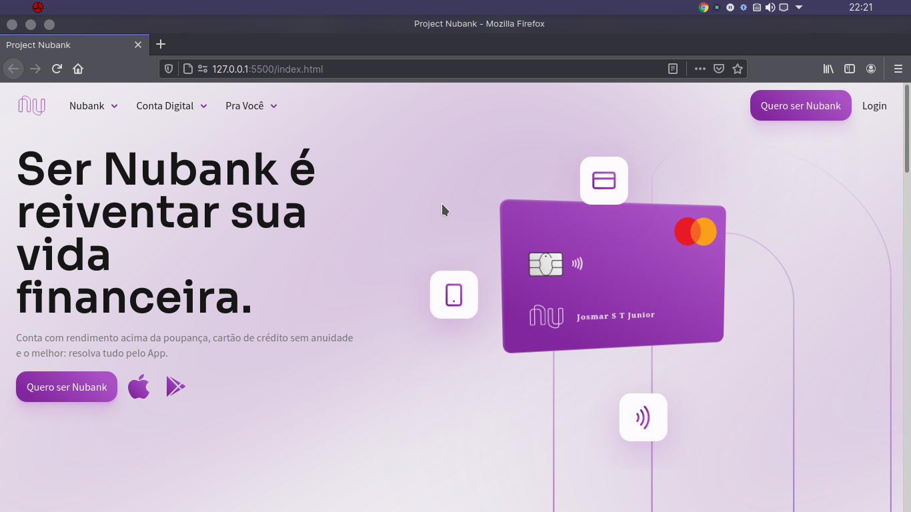

# Um redesign do app Nubank

## Demonstrantion

## Teachs 

* [ ] HTML
* [ ] SASS
* [ ] JavaScript
* [ ] Bibliotecas: SVG-Inject.js e Swiper.js

## Intention

Esse Projeto tem por finalidade praticar conceitos de motion no front-end, aplicando animações e desenvolvendo boas práticas de desenvolvimento.

## Author

**Josmar Junior**

**https://www.linkedin.com/in/josmar-junior-2ab137204**

## Links

**https://josmar-jr.github.io/redesign-nubank/**
